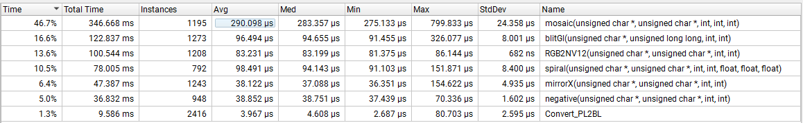

# CUDA Camera Effects

This demo uses OpenCV to fetch frame from camera and send to CUDA for processing and visualisation with OpenGL.

The real challenge of such project is hitting near **zero-copy performance** by keeping most data on GPU and only copying camera frames from host to device by using **Pinned Memory**. On top of that, CUDA streams let us paralelize work by encoding and blitting frame N while copying and processing frame N+1.

On my **RTX 5060** I achieved **sub-ms speeds** in most kernels. This was done by minimizing global memory access with **shared memory** and optimizing kernel efficiency.

What's more, application is encoding frames into HEVC video while displaying real-time result. Output file is ```camera.hevc```.

Kernels reach around 90-95% occupancy with 100% theoretical, meaning GPU cores are used near to full extent during frame processing.

After some careful debugging and tracing, I furtherly improved kernel performance, although there is slowdown from 200 to 300 microseconds in ```mosaic``` kernel that has to be adressed.

### Improved version reports



### Nsight Compute ```spiral``` kernel report


# Dependencies

* CUDA SDK
* GLFW3
* GLAD
* Video Codec SDK
* OpenCV
